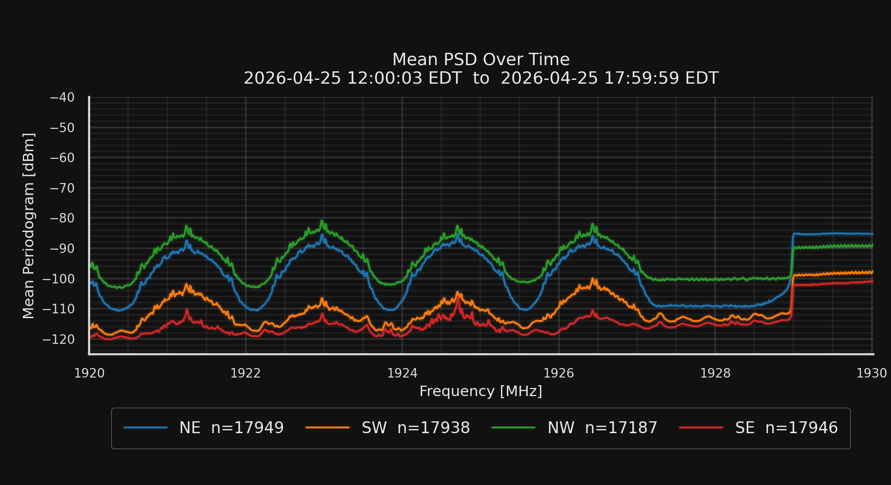
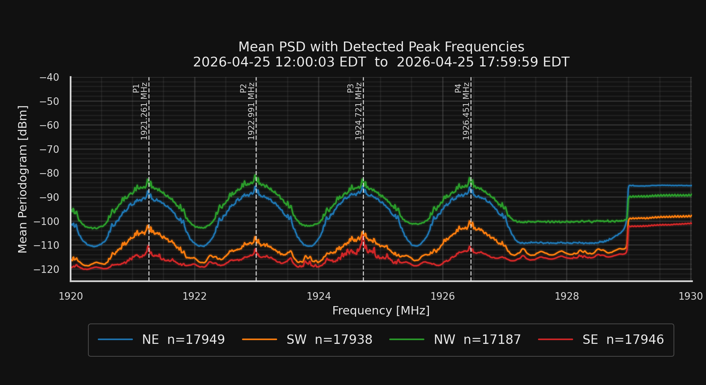
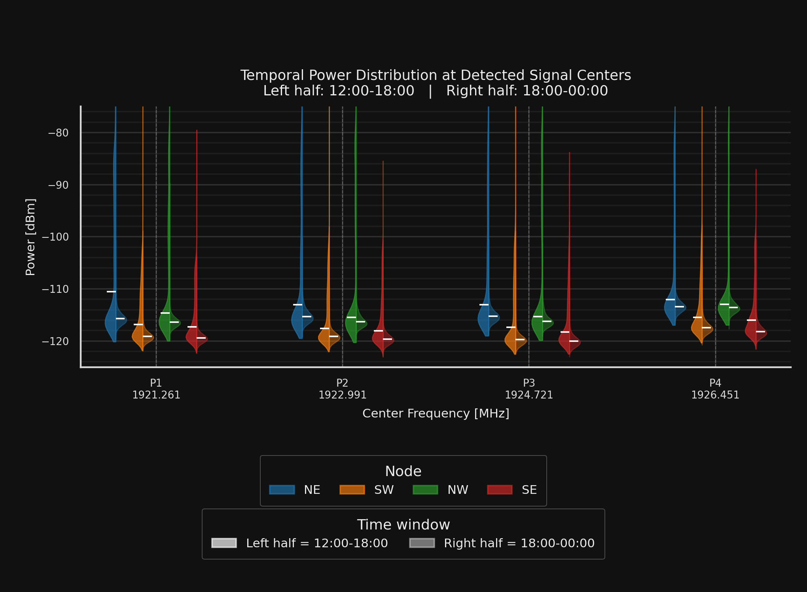

## Mean PSD over the 1920--1930 MHz Band

<figure style="text-align: center;">
  
  <figcaption style="text-align: center;">
    Mean PSD over the 1920&ndash;1930 MHz band for all four RadioHound nodes.
  </figcaption>
</figure>

To summarize the long-duration behavior of the 1920--1930 MHz band, I computed the mean periodogram for each RadioHound node over the full observation window. The averaging was performed in linear power units first, and the final averaged PSD was then converted to dBm. 

The resulting mean PSD shows that the activity in this band is not uniformly distributed across frequency. Instead, several persistent spectral peaks are visible across all four nodes. These repeated peaks indicate that the same channelized structure is observed spatially by the distributed sensors, rather than appearing as a transient artifact at only one node. The strongest recurring features appear around the lower and middle portions of the band, with additional structure toward the upper end near 1929--1930 MHz.

There is also a clear difference in received power between nodes. The NW node observes the highest average power across most of the band, followed by NE, while SW and SE generally observe lower average power. This spatial variation is expected in a distributed sensing setup because each sensor experiences different propagation conditions, antenna placement, shadowing, and local interference. Importantly, even though the absolute received powers differ, the main spectral shapes are consistent across the nodes.

Overall, this mean-PSD view provides a compact summary of the six-hour measurement period.

<figure style="text-align: center;">
  
</figure>

## Temporal Power Distribution at Detected Signal Centers

<figure style="text-align: center;">
  
  <figcaption style="text-align: center;">
    Split violin plot of received power at the four detected signal centers. For each node, the left half corresponds to 12:00--18:00 and the right half corresponds to 18:00--00:00.
  </figcaption>
</figure>

To better understand the temporal distribution of the detected spectral components, I extracted the received power around each of the four identified center frequencies and plotted the resulting distributions using split violin plots. Each frequency center contains four node-specific violins, corresponding to the NE, SW, NW, and SE RadioHound nodes. For each node, the left half of the violin represents the 12:00--18:00 interval, while the right half represents the 18:00--00:00 interval.

This visualization shows that the median received power is generally higher during the 12:00--18:00 interval. This is consistent with the expectation that these signals were active during the main event period and became weaker or absent after 18:00. In the later time window, the distributions move closer to the noise floor, which suggests that the persistent spectral peaks observed in the mean PSD are largely driven by activity during the earlier portion of the measurement.

The split-violin representation is useful because it separates two effects that are difficult to distinguish from the mean PSD alone. First, the node-to-node differences remain visible: NE and NW generally observe stronger power than SW and SE. Second, the temporal change is visible within each node at each frequency center: the higher-power side of the distribution is associated primarily with the 12:00--18:00 interval. This supports the interpretation that the detected peaks correspond to time-varying event-related activity rather than a stationary background feature.

Overall, the violin plot confirms that the four narrowband features are not only visible in the long-term average spectrum, but also have a clear temporal structure. Their received-power distributions are elevated during the active period and decrease toward the noise floor after the event window.