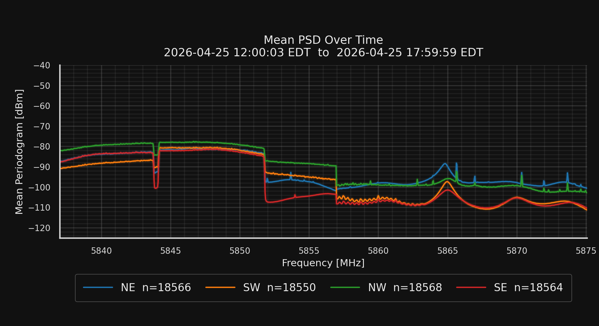
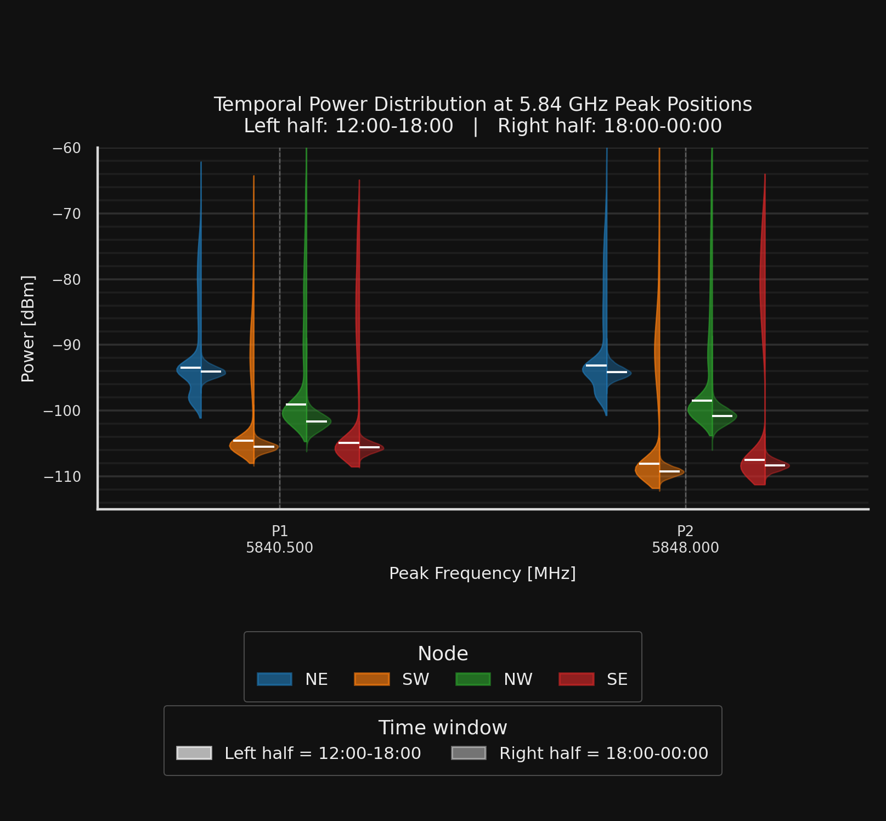

## Mean PSD Over Time

The figure below shows the mean PSD across the four RadioHound nodes during the **12:00:03 EDT to 17:59:59 EDT** interval.

{width=100% fig-align="center"}

From the mean PSD, several features are visible:

- A broad elevated region is present from approximately **5838 MHz to 5852 MHz**.
- There is a noticeable drop around **5844 MHz** and **5852 MHz**, suggesting the edge of an occupied channel or signal block.
- Above this lower-band region, the PSD is generally weaker.
- The received power differs by node.

This node-dependent structure suggests that the observed activity is real RF energy rather than a uniform normalization artifact or simple noise-floor effect.

## Peak-Based Temporal Power Distribution

To better compare the two lower-band locations, power was extracted around **5840.5 MHz** and **5848.0 MHz** and visualized using split violin plots.

- **Left half** of each violin: **12:00–18:00**
- **Right half** of each violin: **18:00–00:00**

{width=85% fig-align="center"}

The violin plot shows a clear ordering across nodes at both peak positions:

- **NE** has the strongest median power at both **P1 = 5840.5 MHz** and **P2 = 5848.0 MHz**.
- **NW** is typically the second strongest.
- **SW** and **SE** are consistently weaker.
- The relative ordering is similar at both peak locations.

This behavior suggests that the two lower-band peaks are likely related to the same event-time wireless activity region, or to nearby channels with similar propagation geometry.

The spread of each violin also shows that the received power is not perfectly constant over time, indicating temporal variation in the observed activity.

## Interpretation

Taken together, the mean PSD and split violin plots suggest that the **5837–5854 MHz** portion of the band contains the most significant lower-band activity during the measurement interval.

The observed PSD shape between roughly **5838 MHz and 5852 MHz** is broad rather than tone-like. This is more consistent with a wideband wireless system than with a narrowband emitter.

The selected peak positions also support this interpretation:

- **P1 = 5840.5 MHz** lies within the lower occupied region.
- **P2 = 5848.0 MHz** lies within the higher part of the same broad occupied region.
- The drop near **5852 MHz** is consistent with the upper edge of this lower-band activity.

## Comparison With Provided Event Frequency Plan

The provided event-frequency list includes two lower-band assignments that are directly relevant to the observed activity:

| Frequency | Bandwidth | System |
|---:|---:|---|
| 5.841 GHz | 8 MHz | WaveCentral |
| 5.850 GHz | 8 MHz | WaveCentral |

This frequency plan is consistent with the observations above. Assuming the listed frequencies are approximate channel centers:

- The **5.841 GHz / 8 MHz WaveCentral** channel would approximately occupy **5837–5845 MHz**.
- The **5.850 GHz / 8 MHz WaveCentral** channel would approximately occupy **5846–5854 MHz**.

These two expected occupied regions line up well with the observed broad elevated PSD region from approximately **5838 MHz to 5852 MHz**.

The two extracted peak positions also fall naturally within these expected WaveCentral regions:

- **P1 = 5840.5 MHz** aligns with the **5.841 GHz WaveCentral** channel.
- **P2 = 5848.0 MHz** aligns with the **5.850 GHz WaveCentral** channel.

Overall, the measured lower-band 5.8 GHz activity is consistent with the provided football-event wireless frequency plan, especially the two **WaveCentral** channels centered at **5.841 GHz** and **5.850 GHz**.