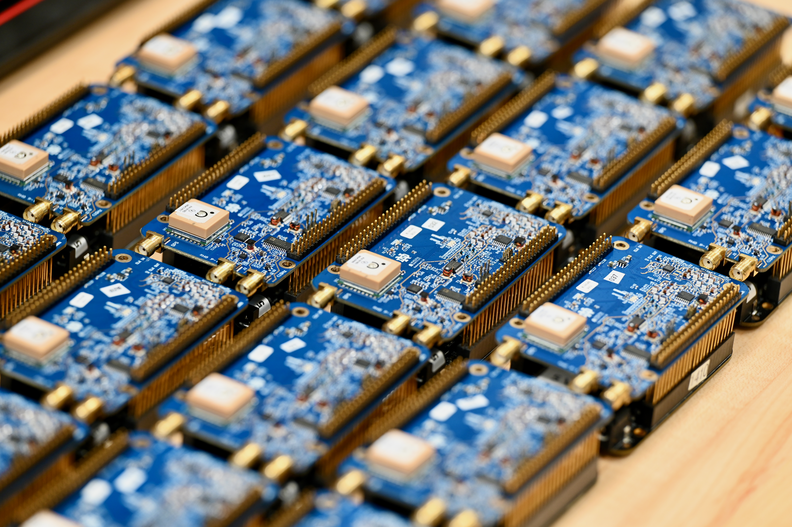

## Overview

This site summarizes longitudinal RF spectrum measurements collected around the Notre Dame Stadium environment using **RadioHound** spectrum sensors.

RadioHound is a low-cost and low-power spectrum sensing platform designed for distributed deployment. The sensors cover a wide frequency range, roughly **100 MHz to 6 GHz**, which makes them useful for observing many types of wireless activity such as cellular, Wi-Fi, intercom systems, telemetry, and event-production links.

```{=html}
<figure style="text-align: center;">
  
  <figcaption>RadioHound spectrum sensor.</figcaption>
</figure>
```

The RadioHound platform is being developed at the **Wireless Institute at the University of Notre Dame**, with major contributions from students and researchers. The goal is to make wide-area spectrum monitoring more scalable by using affordable sensors that can be deployed at many locations instead of relying only on expensive laboratory-grade equipment.

RadioHound includes both the deployed sensing hardware and the software infrastructure used to work with the measurements. The physical RadioHound sensors collect RF spectrum data at different locations, while the browser-based interface makes it easier to visualize and inspect the collected measurements. During deployments, this web interface is useful because it allows researchers to view spectrum activity close to real time, compare activity across sensors, and quickly identify bands or time periods with interesting behavior.

The video below shows an example of this browser-based workflow for visualizing RadioHound spectrum measurements.


```{=html}
<video autoplay muted loop playsinline controls width="100%">
  <source src="content/rh_platform0.mp4" type="video/mp4">
  Your browser does not support the video tag.
</video>
```

For this measurement campaign, **RadioHound hardware version 3.8.1** sensors were deployed around the Notre Dame Stadium environment and collected spectrum data over multiple days. The campaign included **April 25, 2026**, the day of the **Notre Dame Blue-Gold Game**. This allows us to compare regular background spectrum activity with activity observed during a live event.

One motivation for this work is to understand whether large-scale events create recognizable **patterns of life** or **spectrum signatures of life** in the RF environment. The measured bands are not necessarily cellular bands, and nearby base stations may not be able to directly schedule users on all of these frequencies. However, activity in these bands can still provide useful context. For example, intercom systems, wireless video links, telemetry, and other event-production systems can indicate that a large event is underway and can reveal how the RF environment changes during the event.

This type of spectrum context could be informative for nearby wireless infrastructure. If a base station or network controller can recognize the presence and behavior of an event beforehand or in real time, it may be able to make better decisions about scheduling, carrier aggregation, load balancing, or resource allocation in the cellular bands it controls.

Measurements were collected in several frequency ranges:

- **470 to 608 MHz:** Monitored as a UHF spectrum region of interest.
- **902 to 928 MHz:** Monitored as an ISM-band region of interest.
- **1920 to 1930 MHz:** Monitored because of possible Riedel Bolero or DECT-like intercom activity.
- **5.84 to 5.88 GHz:** Monitored because of possible event-production wireless video or WaveCentral-style links.

Although all of these ranges were observed, the **470 to 608 MHz** and **902 to 928 MHz** bands did not show as much activity during the measurement period. Because of that, this site mainly focuses on the **1920 to 1930 MHz** and **5.84 to 5.88 GHz** bands, where the observed activity was stronger and more closely related to event-time wireless systems.

These measurements help show how spectrum activity changes over time, how emissions appear across different sensor locations, and how the observed signals may relate to known wireless systems used during live events.

The goal of this site is to document observed spectral activity, compare activity across distributed nodes, and connect observed emissions to known event-time wireless systems when possible.

## Pages

- [1920 to 1930 MHz](1920_1930_mhz.qmd): Candidate Riedel Bolero or DECT-like intercom activity.
- [5.8 GHz Links](5p8ghz_links.qmd): Candidate video or WaveCentral-style links near the football event window.
- [Temporal PSD](longitudinal_psd.qmd): Time-evolving PSD views across nodes.