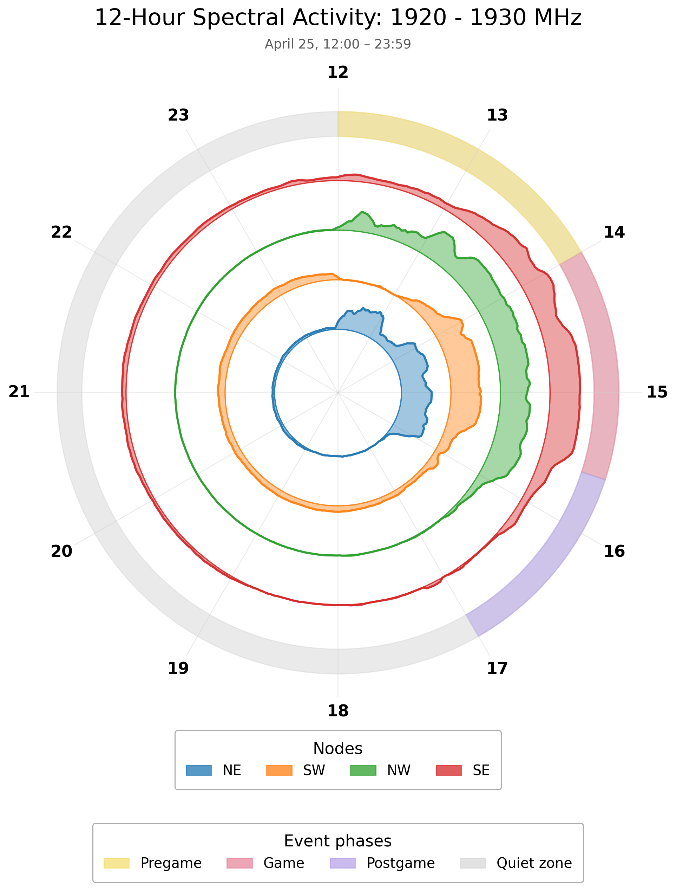
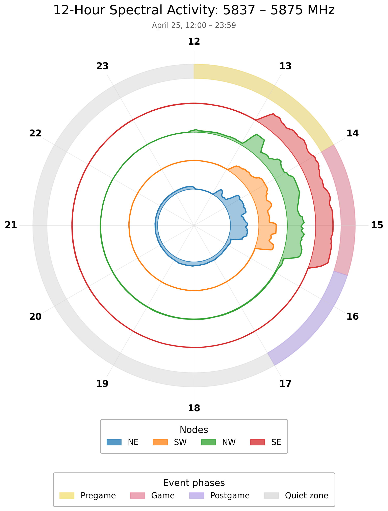

## 1920--1930 MHz Activity

<figure class="annular-figure">
  
  <figcaption>
    Annular 12-hour spectral activity visualization for the 1920--1930 MHz band.
  </figcaption>
</figure>

The animation below summarizes PSD snapshots from **April 25, 2026, 12:00--18:00 EDT**, with one frame approximately every minute. Each curve corresponds to one receiver node: **NE**, **SW**, **NW**, and **SE**.

The monitored band from **1920 to 1930 MHz** contains activity consistent with the event frequency plan for the **Riedel Bolero intercom system**, which uses DECT-style timing in this band. The time-evolving PSD shows several emissions that appear and disappear over the course of the event.

A recurring feature is visible near the upper portion of the band, especially around **1925--1930 MHz**. This signal has a relatively wide, flat, noise-like PSD shape that looks somewhat OFDM-like in the frequency domain. Based on its bandwidth, persistence, and position in the DECT allocation, this emission may correspond to a base-station/access-point-type transmitter or another infrastructure-side component of the intercom system. However, PSD alone is not enough to definitively identify the transmitter role, so this interpretation should be treated as a likely explanation rather than a confirmed label.

The video also highlights the spatial variation across the distributed receivers. The same spectral activity can appear strong at one node while being much weaker at another, suggesting differences due to transmitter location, propagation, antenna orientation, blockage, or local interference. This longitudinal view is useful because it shows not only whether a signal is present, but also **when** it is active, **how long** it persists, and **which receivers observe it most strongly**.

<video class="psd-video" controls autoplay loop muted playsinline>
  <source src="content/1920-1930-psd.mp4" type="video/mp4">
  Your browser does not support the video tag.
</video>

## 5837--5875 MHz Activity

<figure class="annular-figure">
  
  <figcaption>
    Annular 12-hour spectral activity visualization for the 5837--5875 MHz band.
  </figcaption>
</figure>

The second longitudinal view focuses on activity in the higher-frequency band from **5.837 to 5.875 GHz**. This band shows a different type of behavior compared with the 1920--1930 MHz DECT activity. Instead of many short-lived narrow emissions, the dominant features are wider signals with relatively flat, noise-like spectra.

During the game, two clear OFDM-like signals are visible. They are centered approximately around **5.8405 GHz** and **5.848 GHz**, each occupying several MHz of bandwidth. These signals remain active during the game period and then disappear when the game ends, suggesting that they are likely associated with temporary event operations rather than persistent background activity.

The PSD shape is consistent with wideband digital links, such as video, telemetry, or other event-support wireless systems operating in the 5 GHz range. As with the DECT case, the exact transmitter type cannot be confirmed from PSD alone, but the timing, bandwidth, and OFDM-like spectral shape strongly suggest coordinated event-related usage.

The distributed receiver view is again useful here because the two signals are not observed identically at all nodes. Some receivers see the activity more strongly than others, which provides spatial information about where the transmitters may be located relative to the sensor deployment.

<video class="psd-video" controls autoplay loop muted playsinline>
  <source src="content/5_ghz-psd.mp4" type="video/mp4">
  Your browser does not support the video tag.
</video>